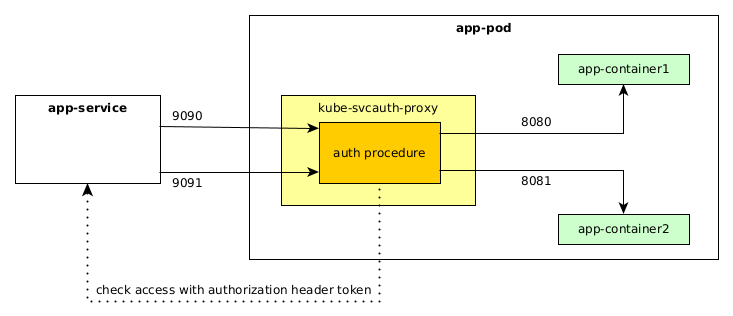

# kube-svcauth-proxy

Multi-channel reverse proxy, to secure pod service from unauthorized access.

_kube-svcauth-proxy_ can serve multiple routes, listen->upstream pairs, each configured separately.
Authorization procedure is simple get request to the configured service name in configured
namespace. With this we don't need any cluster-wide permissions.



## Configuration

Args:

```
Usage of ./main:
  -conf string
    	Path to config yaml file. (default "conf.yaml")
```

Config file:

```yaml
proxy:
  - listen: ":9090"
    upstream: "http://127.0.0.1:8080"
    namespace: "app-namespace"
    service: "app-service"
  - listen: ":9091"
    upstream: "http://127.0.0.1:8081"
    namespace: "app-namespace"
    service: "app-service"
```

- _listen_ - listen on this address
- _upstream_ - forward to this address
- _namespace_ - check access in this namespace
- _service_ - check access to this service

## Motivation

There is [`kube-rbac-proxy`](https://github.com/brancz/kube-rbac-proxy), which serve similar goal.
However, there are few reasons why it doesn't suite us well in our use-case:
- kube-rbac-proxy does not support multiple routes, so that would mean that we would need one
  kube-rbac-proxy instance per port, which is huge overhead. In Eclipse Che, that would mean extra
  container per secured workspace endpoint. That's 5+ extra containers per workspace. Alternatively
  we would need another reverse-proxy container that would do the routing, which would make
  deployment and configuration more complex.
- kube-rbac-proxy needs cluster permissions to `tokenreviews` and `subjectaccessreviews`. That would
  mean that every workspace `ServiceAccount` would need to have these permissions. In DevWorkspace
  world that would mean to have extra `ClusterRoleBinding` per workspace.
